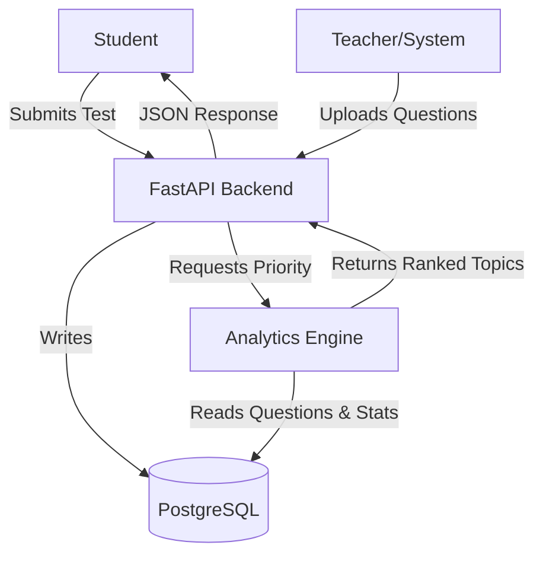

# Study Priority Engine - System Architecture

This system acts as an intelligent decision engine to guide students on what to study next based on exam data and personal performance.

## 1. High-Level Architecture

## 2. Core Components

### A. Topic/Question Bank (The "Knowledge Base")
- Stores questions tagged with:
  - **Topic** (e.g., "Calculus")
  - **Year** (e.g., 2024 - crucial for Recency)
  - **Marks** (e.g., 10 - crucial for Weightage)

### B. Analytics Engine (The "Brain")
Calculates two key metrics:
1. **Topic Importance (Global)**:
   $$ I_t = w_1 \cdot Norm(Freq) + w_2 \cdot Norm(Marks) + w_3 \cdot Norm(Recency) $$
2. **Student Mastery (Personal)**:
   $$ M_s = \frac{\sum CorrectAnswers}{\sum Attempts} $$
3. **Priority Score**:
   $$ P = I_t \times (1 - M_s) $$

### C. API Layer
- **FastAPI** application serving REST endpoints.
- **Pydantic** for rigid schema validation.

## 3. Database Schema

- **Subjects/Topics**: Hierarchical organization.
- **Questions**: Core data units.
- **TestResults/StudentAnswers**: Granular performance tracking (per question).

## 4. API Specification

| Method | Endpoint | Description |
| envol | --- | --- |
| `POST` | `/upload-question-paper` | bulk upload questions with metadata |
| `POST` | `/mock-test-result` | submit raw test answers |
| `GET` | `/study-plan/{student_id}` | get the ranked list of topics |

## 5. Technology Stack
- **Backend**: Python 3.9+, FastAPI
- **Database**: PostgreSQL (SQLAlchemy ORM)
- **Analytics**: Pandas (Dataframes for efficient aggregation)
