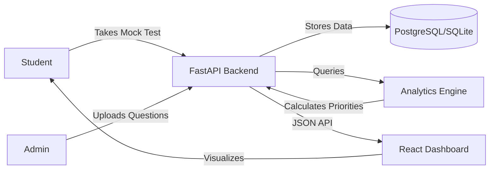

# Study Priority Engine

> **An intelligent exam preparation system that analyzes past exam patterns and personal performance to generate data-driven study priorities**

[](https://python.org)
[](https://fastapi.tiangolo.com)
[](https://reactjs.org)
[](LICENSE)

---

## 🎯 Problem Statement

Students preparing for competitive exams (JEE, NEET, etc.) face a critical problem:

- **50-100 topics** to cover in limited time
- **No clear strategy** on what to study first
- **Wasted effort** on already-mastered or low-yield topics
- **Decision paralysis** from information overload

**Result:** Suboptimal scores despite hard work.

---

## 💡 Solution

The **Study Priority Engine** is a decision support system that:

1. **Analyzes exam data** (frequency, marks, recency of topics)
2. **Tracks student mastery** (accuracy on mock tests)
3. **Calculates priority scores** using the formula:
   ```
   Priority = Exam Importance × (1 - Student Mastery)
   ```
4. **Outputs actionable plan**: Clear ranked list of "what to study next"

**Outcome:** Students focus on high-yield topics where they're weakest, maximizing score improvement.

---

## 🏗️ System Architecture



### Core Components

1. **Backend (FastAPI + SQLAlchemy)**
   - REST API for data management
   - Pydantic schema validation
   - Database ORM

2. **Analytics Engine (Pandas)**
   - Topic importance calculation (frequency, marks, recency)
   - Student mastery tracking
   - Priority ranking algorithm

3. **Frontend (React + Vite)**
   - Interactive priority dashboard
   - Visual charts and progress tracking
   - Downloadable study plans

---

## 📊 The Algorithm

### 1. Topic Importance (Global Metric)

```python
Importance = (0.35 × Frequency) + (0.45 × Marks) + (0.20 × Recency)
```

- **Frequency**: How often topic appears in exams (normalized 0-1)
- **Marks**: Total marks weightage across exams (normalized 0-1)
- **Recency**: Time decay factor (recent exams weighted higher)

### 2. Student Mastery (Personal Metric)

```python
Mastery = (Correct Answers / Total Attempts) × Confidence Factor
```

- **Confidence Factor**: 0.7 if attempts < 3 (penalize lucky guesses)

### 3. Priority Score (The Core Formula)

```python
Priority = Importance × (1 - Mastery)
```

**Why multiplication?** Ensures that mastered topics (Mastery=1.0) get Priority=0, regardless of importance.

---

## 🚀 Quick Start

### Prerequisites
- Python 3.9+
- Node.js 16+

### Backend Setup
```bash
# Install dependencies
pip install -r backend/requirements.txt

# Initialize database with sample data
export PYTHONPATH=$PYTHONPATH:$(pwd)/backend
python backend/seed_data.py

# Start API server
uvicorn backend.app.main:app --reload --port 8000
```

### Frontend Setup
```bash
cd frontend
npm install
npm run dev
```

**Access:**
- Frontend: http://localhost:5173
- API Docs: http://localhost:8000/docs

---

## 📸 Screenshots

### Dashboard Overview
Shows prioritized topics with visual bars, categorized by urgency (Study Now, Revise Later, Mastered, Deprioritize).

### Priority Breakdown
Each topic card displays:
- Priority score (0-100%)
- Exam importance
- Your mastery level
- Actionable recommendation

### Study Plan Export
Downloadable text summary with detailed explanations and action plan.

---

## 🧪 Testing & Validation

### Run Logic Verification
```bash
python verify_logic.py
```

Demonstrates that:
- High importance + Low mastery = High priority ✅
- High importance + High mastery = Low priority ✅
- Edge cases handled (empty data, division by zero) ✅

### Run Automated Tests
```bash
cd backend
pytest test_analytics.py -v
```

8 test cases covering:
- Edge cases (empty database, zero mastery)
- Formula correctness (recency decay, mastery damping)
- Ranking logic (priority order, categorization)

---

## 📚 Documentation

| Document | Description |
|----------|-------------|
| [COMPLETION_ROADMAP.md](COMPLETION_ROADMAP.md) | Step-by-step project completion guide |
| [VIVA_PREP.md](VIVA_PREP.md) | 22 detailed Q&A for viva/interview |
| [PROJECT_REPORT.md](PROJECT_REPORT.md) | Abstract, methodology, future scope |
| [ARCHITECTURE.md](ARCHITECTURE.md) | System design and tech stack |
| [DEPLOYMENT.md](DEPLOYMENT.md) | Local setup and production deployment |
| [TESTING.md](TESTING.md) | Validation and edge case handling |

---

## 🎓 Key Features

### ✅ Implemented
- [x] Topic importance calculation (frequency + marks + recency)
- [x] Student mastery tracking with confidence damping
- [x] Priority ranking with percentile-based categorization
- [x] REST API with FastAPI (3 endpoints)
- [x] Interactive React dashboard
- [x] Visual priority charts
- [x] Downloadable study plans
- [x] Edge case handling (cold start, NaN, division by zero)
- [x] Comprehensive test suite

### 🔮 Future Enhancements

**Phase 2: Advanced Analytics**
- Spaced repetition (re-prioritize after 30 days)
- Forgetting curves (Ebbinghaus model)
- Study time estimation

**Phase 3: Automation**
- LLM-powered auto-tagging (extract topics from PDFs)
- Smart question generation
- Adaptive weights (learn from outcomes)

**Phase 4: Product Features**
- Multi-user cohort analysis
- Collaborative filtering ("Students who struggled with X also struggled with Y")
- Integration APIs for ed-tech platforms

---

## 🔬 Technical Highlights

### Robust Edge Case Handling
```python
def robust_normalize(series):
    # Handles division by zero when all values are equal
    if max == min:
        return [1.0 if x > 0 else 0.0]
    return (series - min) / (max - min)
```

### Cold Start Solution
```python
# NEW students (no test data) → Mastery defaults to 0.0
final_df['mastery_score'] = final_df['mastery_score'].fillna(0.0)
# Priority = Importance × (1 - 0) = Pure importance ranking
```

### Confidence Damping
```python
# Penalize unreliable mastery scores (< 3 attempts)
if attempts < 3:
    mastery_score *= 0.7  # 30% confidence penalty
```

---

## 🎯 Target Audience

### Primary: Coaching Institutes (B2B)
- **Pain Point:** Can't personalize for 500+ students
- **Solution:** Automated weekly study plans
- **Value:** 1 teacher manages 100 students effectively

### Secondary: Self-Study Students (B2C)
- **Pain Point:** Overwhelmed, don't know where to start
- **Solution:** Clear "Top 5 to study this week" list
- **Value:** Maximizes limited study time

### Tertiary: Ed-Tech Platforms (API)
- **Pain Point:** Quiz apps have data, no prioritization logic
- **Solution:** Plug-in API for smart recommendations
- **Pricing:** Pay-per-use ($0.10/call)

---

## 📈 Business Model

**Freemium:**
- Free: 3 study plans per month
- Pro ($5/month): Unlimited plans + advanced features

**B2B:**
- Coaching institutes: $500/month (white-label)
- API access: Usage-based pricing

**Moat:**
- Curated question bank (6-12 months to build)
- Validated weights from user outcomes (network effects)
- First-mover advantage in exam-specific corpus

---

## ⚖️ Assumptions & Limitations

### Assumptions
- Manual question tagging is accurate
- Mock tests representative of actual exam difficulty
- Student attempts questions honestly (no random guessing)

### Current Limitations
1. **Cold Start:** New students/topics have minimal data
   - *Mitigation:* Default to importance-based ranking
2. **Static Weights:** Hardcoded (0.35, 0.45, 0.20)
   - *Future:* Learn optimal weights via regression
3. **No Semantic Understanding:** Tags only, not content analysis
   - *Future:* NLP-based topic extraction
4. **Single Exam Focus:** Optimized for one exam type
   - *Future:* Multi-exam profiles

---

## 🤝 Contributing

Contributions welcome! Areas for improvement:

1. **Frontend:**
   - Mobile responsiveness enhancements
   - Dark mode toggle
   - Accessibility (ARIA labels)

2. **Backend:**
   - GraphQL API option
   - Real-time updates (WebSockets)
   - Advanced caching (Redis)

3. **Analytics:**
   - A/B testing framework for weights
   - Bayesian confidence intervals
   - Time-series forecasting

---

## 📄 License

MIT License - see [LICENSE](LICENSE) file for details.

---

## 🙏 Acknowledgments

- **FastAPI**: Amazing framework for rapid API development
- **Pandas**: Powerful data manipulation for analytics
- **React**: Intuitive UI component library
- **SQLAlchemy**: Robust ORM for database management

---

## 📧 Contact

**Project Maintainer:** [Your Name]  
**Email:** [your.email@example.com]  
**Demo:** [Insert deployed URL]  
**GitHub:** [Repository URL]

---

## 🎓 Academic Context

This project was developed as a final-year project demonstrating:
- System design and architecture
- Data analysis and algorithm implementation
- Full-stack development (backend + frontend)
- User-centered problem solving
- Professional documentation and testing

**Institution:** [Your College]  
**Department:** Computer Science & Engineering  
**Year:** 2024-2026

---

**Built with 💻 and ☕ by [Your Name]**

*"Optimize study time. Maximize exam scores."*
