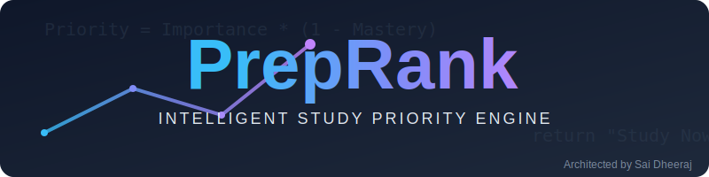
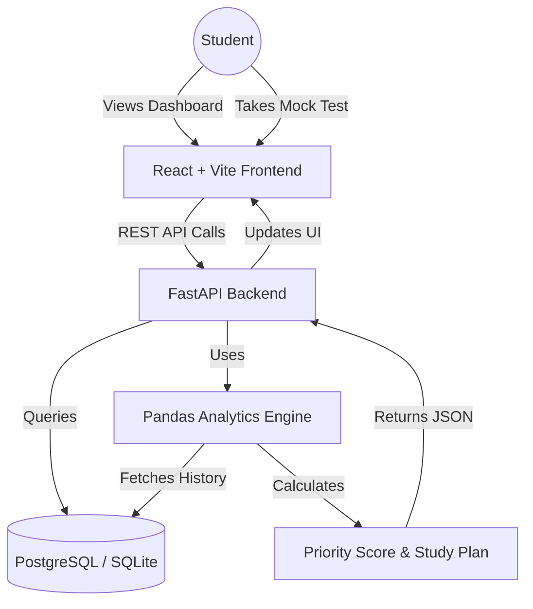

<!-- PROJECT HEADER -->
<br />
<div align="center">
  
  
  <p align="center">
    <strong>The Intelligent Decision Engine for Competitive Exams</strong>
    <br />
    <em>"Stop guessing. Start ranking. Optimize your limited study time."</em>
    <br />
    <br />
    <a href="https://github.com/SaiDheeraj-19/PrepRank/issues">Report Bug</a>
    ·
    <a href="https://github.com/SaiDheeraj-19/PrepRank/issues">Request Feature</a>
  </p>
</div>

<!-- TECH STACK BADGES -->
<div align="center">
  
  
  
  
  
</div>

<br />

<!-- TABLE OF CONTENTS -->
<details>
  <summary><strong>📚 Table of Contents</strong> (Click to Expand)</summary>
  <ol>
    <li><a href="#-about-the-project">About The Project</a></li>
    <li><a href="#-key-features">Key Features</a></li>
    <li><a href="#-system-architecture">System Architecture</a></li>
    <li><a href="#-folder-structure">Folder Structure</a></li>
    <li><a href="#-the-algorithm">The Algorithm</a></li>
    <li><a href="#-getting-started">Getting Started</a></li>
    <li><a href="#-license">License</a></li>
    <li><a href="#-contact">Contact</a></li>
  </ol>
</details>

---

## 💡 About The Project

> **"I have 50 topics to study and only 30 days left. Where do I even start?"**

Every student faces decision paralysis. Traditional tools are passive—they track what you *did*. **PrepRank** is active—it tells you what you *should do*. It acts as a **Decision Support System**, analyzing exam history and your personal performance to generate a scientifically prioritized roadmap.

### Why PrepRank?
*   ✅ **Data-Driven**: No more intuition. Uses hard data (frequency, marks, recency).
*   ✅ **Personalized**: Adapts to *your* weaknesses.
*   ✅ **Visual**: See your progress in beautiful, interactive charts.

---

## ✨ Key Features

| Feature | Description |
| :--- | :--- |
| **📊 Smart Ranking Engine** | Dynamically re-ranks topics daily based on new performance data. |
| **🧠 Mastery Tracking** | Intelligent "Confidence Score" penalizes lucky guesses on mock tests. |
| **📅 Exam DNA Analysis** | Weights topics by Frequency (35%), Marks (45%), and Recency (20%). |
| **🎨 Actionable Dashboard** | Clean UI separating tasks into "Study Now" 🔴, "Revise" 🟡, and "Mastered" 🟢. |
| **🔌 Extensible API** | Built on FastAPI, ready integration with any LMS. |

---

## 🏗️ System Architecture

PrepRank follows a modern 3-tier architecture designed for scalability and separation of concerns.



---

## 📂 Folder Structure

A meticulous breakdown of the codebase organization.

```text
PrepRank/
├── 📂 backend/                # Python FastAPI Backend
│   ├── 📂 app/                
│   │   ├── 📄 analytics.py    # 🧠 Core Algorithmic Engine (Pandas logic)
│   │   ├── 📄 database.py     # 🔌 Database connection pooling
│   │   ├── 📄 main.py         # 🚦 API Route definitions & entry point
│   │   ├── 📄 models.py       # 🗄️ SQLAlchemy DB Schemas (Tables)
│   │   └── 📄 schemas.py      # 🛡️ Pydantic Data Validation Models
│   ├── 📄 seed_data.py        # 🌱 Script to populate demo exam data
│   ├── 📄 test_analytics.py   # ✅ Unit tests for the ranking engine
│   └── 📄 requirements.txt    # 📦 Python dependencies
│
├── 📂 frontend/               # React + Tailwind Frontend
│   ├── 📂 public/             # Static assets
│   ├── 📂 src/
│   │   ├── 📂 components/     # 🧩 Reusable React Components
│   │   │   ├── 📄 PriorityChart.jsx    # 📊 Recharts Bar Chart
│   │   │   ├── 📄 StudyPlan.jsx        # 📝 The "Action Plan" List
│   │   │   └── 📄 TopicPriorityTable.jsx # 📋 Detailed data grid
│   │   ├── 📂 services/       # 📡 API Integration Layer
│   │   │   └── 📄 api.js      # Fetch wrapper for Backend API
│   │   ├── 📄 App.jsx         # 📱 Main Layout & State Management
│   │   └── 📄 main.jsx        # 🚀 Application Entry Point
│   ├── 📄 index.css           # 🎨 Global styles & Tailwind directives
│   ├── 📄 tailwind.config.js  # ⚙️ Tailwind configuration
│   └── 📄 vite.config.js      # ⚡ Vite bundler settings
│
├── 📂 assets/                 # 🖼️ Project Images & Logos
│   └── 📄 banner.svg          # Beautiful SVG Banner
├── 📄 LICENSE                 # ⚖️ MIT License
└── 📄 README.md               # 📖 The file you are reading!
```

---

## 🧬 The Algorithm

We believe in transparency. Here is the math that powers your success:

<div align="center">
  <h3><code>Priority = Importance × (1 - Mastery)</code></h3>
</div>

<details>
<summary><strong>See Detailed Formula Breakdown</strong> (Click to Expand)</summary>

#### 1. Global Importance Score (The "Yield")
How valuable is a topic globally?
```math
Importance = (0.35 \times Frequency) + (0.45 \times Marks) + (0.20 \times Recency)
```

#### 2. Personal Mastery Score (The "Gap")
How well do *you* know it?
```math
Mastery = \frac{Correct \ Answers}{Total \ Attempts} \times ConfidenceFactor
```
*(ConfidenceFactor penalty applied if attempts < 3)*

#### 3. Interpretation
| Score | Meaning | Action |
| :--- | :--- | :--- |
| **High Importance + Low Mastery** | 🔴 Critical Gap | **STUDY NOW** |
| **High Importance + High Mastery** | 🟢 Secure | **Revise Later** |
| **Low Importance** | ⚪ Low Yield | **Deprioritize** |

</details>

---

## 🚀 Getting Started

Follow these steps to get your local copy up and running.

### Prerequisites

*   **Python 3.9+**
*   **Node.js 16+**

### Installation

**1. Clone the Repository**
```bash
git clone https://github.com/SaiDheeraj-19/PrepRank.git
cd PrepRank
```

**2. Ignite the Backend (Python)** 🔥
```bash
# Create virtual environment (Recommended)
python -m venv venv
source venv/bin/activate  # On Windows: venv\Scripts\activate

# Install dependencies
pip install -r backend/requirements.txt

# Seed the database with demo data impact
python backend/seed_data.py

# Launch the API
uvicorn backend.app.main:app --reload --port 8000
```

**3. Launch the Frontend (React)** 🛸
```bash
# Open a new terminal
cd frontend

# Install dependencies
npm install

# Start the dashboard
npm run dev
```

Visit `http://localhost:5173` and see your priorities!

---

## 📜 License

Distributed under the MIT License. See `LICENSE` for more information.

---

## 📬 Contact

**Sai Dheeraj** - [GitHub Profile](https://github.com/SaiDheeraj-19)

<div align="center">
  <br />
  <p>Built with ❤️ and ☕ for students everywhere.</p>
  
  
</div>
